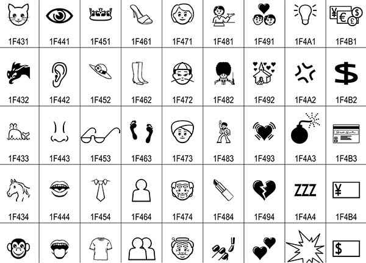

# Unicode 与emoji

### 什么是Unicode
Unicode是国际组织制定的可以容纳世界上 **所有**文字和符号的字符编码方案，它为每种语言中的每个字符设定了统一并且唯一的编码。

表示一个Unicode的字符时，通常会用“U+”然后紧接着一组十六进制的数字来表示这一个字符。比如： U+4E25，U+1F600， U+1F601

**那unicode和UTF-8有何区别？**     
通俗点就是
* Unicode 是「字符集」
* UTF-8 是「编码规则」

**字符集**：为每一个「字符」分配一个唯一的 ID（学名为码位 / 码点 / Code Point）   
**编码规则**：将「码点」转换为字节序列的规则

###JS中如何使用Unicode

**编码**：

1.字符串形式      
javaScript 允许采用 **\uxxxx**形式表示一个字符，其中xxxx表示字符的 Unicode 码点。仅限于码点在 **\u0000~\uFFFF**之间的字符。超出这个范围的字符，必须用两个双字节的形式表示。
```js
"\u0061" // 'a'

// es6表示法(支持超过0xFFFF的数值)
"\u{1F601}"
```

2. js方法   

**es5**: **String.fromCharCode(Unicode)** (局限于Unicode 码点不大于0xFFFF)
```js
String.fromCharCode(65) //return "A"
```

**es6**: **String.fromCodePoint(Unicode)** (支持Unicode 码点大于0xFFFF)
```js
String.fromCodePoint('0x1F601') // "😁"
String.fromCodePoint('128513') // "😁"
```

**解码**     

**es5**: **str.charCodeAt()** (局限于Unicode 码点不大于0xFFFF)
```js
var str = 'ABC'
str.charCodeAt(0) // 65
```

**es6**: **str.codePointAt()** (支持Unicode 码点大于0xFFFF)
```js
var str = "😁"
str.codePointAt(0) // 128513 10进制
str.codePointAt(0).toString(16) // "1f601" 16进制
```

### emoji的编码
emoji 也是一个Unicode字符。2010年，Unicode 开始为 Emoji 分配码点。   
比如：**U+1F4C5，U+1F468， U+1F600**等      
Unicode 只是规定了 Emoji 的码点和含义，并没有规定它的样式。举例来说，码点U+1F600表示一张微笑的脸，但是这张脸长什么样，则由各个系统自己实现。

如果用户的系统没有实现这个Emoji符号，用户就会看到一个没有内容的方框，因为系统无法渲染这个码点。



参考链接：[emoji-text](http://www.unicode.org/Public/emoji/11.0/emoji-test.txt)

截至目前，共有2789个emoji字符；

###emoji组合
Unicode 允许多个码点组合表示一个 Emoji。
通过 **零宽度连接符U+200D**实现。
```
U+1F468：男人
U+1F469：女人
U+1F467：女孩
比如U+1F468 U+200D U+1F469 U+200D U+1F467，就会显示为一个 Emoji 👨‍👩‍👧
如果用户的系统不支持这种方法，就还是显示为三个独立的 Emoji 👨👩👧
```

零宽连字符（zero-width-joiner，ZWJ）是一个不打印字符，放在某些需要复杂排版语言（如阿拉伯语、印地语）的两个字符之间。
零宽连字符使得这两个本不会发生连字的字符产生了连字效果。零宽连字符的Unicode码位是U+200D

```js
// 多码点转成emoji组合
function unifiedToNative(unified) {
  var unicodes = unified.split('-'),
      codePoints = unicodes.map((u) => `0x${u}`)

  return String.fromCodePoint(...codePoints)
}

// 多组合emoji 转成码点
var s = '👩‍❤️‍👩';
for (let ch of s) {
  console.log(ch.codePointAt(0).toString(16)); // 1f469 200d 2764 fe0f 200d 1f469
}
```
