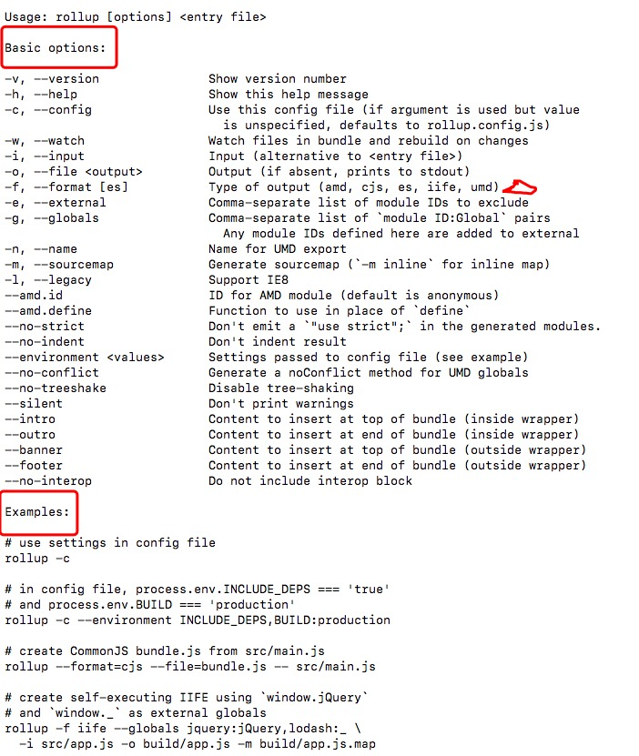

### rollup 下一代 ES6 模块化工具
### 介绍
Rollup 是一个 JavaScript 模块打包器，用来将很细碎的js编译打包成大的复杂的代码。其使用了ES6自带的新标准来格式化和打包js代码，而不是原先的Commonjs或者AMD这类解决方案。

### 安装
使用`npm install --global rollup` 或者 `yarn global add rollup` 命令下载安装,
你可以用他自己的 **Javascript API**来调用，也可以使用 **一个配置文件**使用命令行接口。运行`rollup --help`查看可用的命令和参数。


```json
-i, --input                 要打包的文件（必须）
-o, --output.file           输出的文件 (如果没有这个参数，则直接输出到控制台)
-f, --output.format [es]    输出的文件类型 (amd, cjs, es, iife, umd)
-e, --external              将模块ID的逗号分隔列表排除
-g, --globals               以`module ID:Global` 键值对的形式，用逗号分隔开 
                              任何定义在这里模块ID定义添加到外部依赖
-n, --name                  生成UMD模块的名字
-m, --sourcemap             生成 sourcemap (`-m inline` for inline map)
--amd.id                    AMD模块的ID，默认是个匿名函数
--amd.define                使用Function来代替`define`
--no-strict                 在生成的包中省略`"use strict";`
--no-conflict               对于UMD模块来说，给全局变量生成一个无冲突的方法
--intro                     在打包好的文件的块的内部(wrapper内部)的最顶部插入一段内容
--outro                     在打包好的文件的块的内部(wrapper内部)的最底部插入一段内容
--banner                    在打包好的文件的块的外部(wrapper外部)的最顶部插入一段内容
--footer                    在打包好的文件的块的外部(wrapper外部)的最底部插入一段内容
--interop                   包含公共的模块（这个选项是默认添加的）
```

```Javascript
// 指令
rollup src/main.js -o bundle.js -f cjs

```

### 为什么会有它
把项目分成各个小的部分来开发软件通常活容易些。因为经常需要去掉代码不期望的行为，也能够很大程度上降低解决问题的复杂程度，而且可以只在项目的第一个位置写一些小的项目而不是 isn't necessarily the answer。不幸的是，JavaScript本身的语言设计没有这类功能。

### Tree-shaking (过滤树功能)
Tree-shaking是活的代码放入——code inclusion，是一种只填加那些使用了的代码的处理，类似于无用代码剔除，然后提高效率, rollup会静态地分析你所引入的模块，然后去掉没有真正用到的部分。这会帮助你至引入那些需要的东西，并且减少项目的体积。


**下面演示几个demo**

### 使用配置文件
但是当我们开始添加更多的设置时，这就变成了令人讨厌的在命令行输入（很多）指令。为了保存我们自己常用的设置，我们可以创建一个配置文件，里面保存我们需要的设置。使用js写配置文件比使用命令行方便多了。

Rollup的配置文件是可选的，但是使用配置文件的作用很强大，而且很方便，因此推荐你使用。

配置文件是一个ES6模块，它对外暴露一个对象，这个对象包含了一些Rollup需要的一些选项。通常，我们把这个配置文件叫做rollup.config.js，它通常位于项目的根目录
```js
// rollup.config.js
export default {
  // 核心选项
  input,     // 必须
  external,
  plugins,

  // 额外选项
  onwarn,

  // danger zone
  acorn,
  context,
  moduleContext,
  legacy

  output: {  // 必须 (如果要输出多个，可以是一个数组)
    // 核心选项
    file,    // 必须
    format,  // 必须
    name,
    globals,

    // 额外选项
    paths,
    banner,
    footer,
    intro,
    outro,
    sourcemap,
    sourcemapFile,
    interop,

    // 高危选项
    exports,
    amd,
    indent
    strict
  },
};

```

你必须使用配置文件才能执行以下操作：

把一个项目打包，然后输出多个文件
使用Rollup插件, 例如 rollup-plugin-node-resolve 和 rollup-plugin-commonjs 。这两个插件可以让你加载Node.js里面的CommonJS模块

在根目录创建一个配置文件，命名rollup.config.js，然后添加如下代码。
```js
// rollup.config.js
export default {
  input: 'src/main.js',
  output: {
    file: 'dist/bundle.js',
    format: 'cjs'
  }
};
```

```markdown 
rm bundle.js //先把bundle.js 删除
rollup -c

// 如果你想使用Rollup的配置文件，记得在命令行里加上--config或者-c

命令rollup -c -w(rollup --config --watch缩写)会以监视模式运行rollup
```
**注意：rollup是自己运行配置文件，因此我们可以使用export default语法。语法没有被bable编译，所以你只能使用当前node版本所支持的es2015语法。）**

### 开始使用插件

在这里我们将使用`rollup-plugin-json`插件，它能够使rollup导入json文件里的数据。

首先安装依赖
```
yarn add rollup-plugin-json
```

接着编写

```js
// // src/main.js
import { version } from './package.json';

export default function () {
  console.log('version ' + version);
}

// rollup.config.js
import json from 'rollup-plugin-json';

export default {
  input: 'src/main.js',
  output: {
    file: 'bundle.js',
    format: 'cjs'
  },
  plugins: [ json() ]
};
```

[插件资源](https://github.com/rollup/rollup/wiki/Plugins)


### Rollup 与其他工具集成

#### 结合npm库使用rollup
在某种情况下，你的项目需要下载npm的第三方模块到你的node_modules文件夹中。跟其他的如webpack，Browserfy不同，rollup不知道out of box，怎么处理这些依赖，我们需要添加一些设置。
安装 一个the answer依赖
```js
yarn add the-answer

// main.js
import answer from 'the-answer';

export default function () {
  console.log('the answer is ' + answer);
}
```

然后打包
这时候可能会有一个waring
```
(!) Unresolved dependencies
https://github.com/rollup/rollup/wiki/Troubleshooting#treating-module-as-external-dependency
the-answer (imported by main.js)
```


打包后的bundle.js仍然会在 Node.js 中工作，因为import声明转变成了 CommonJS中的 require 语句，但是the-answer不包含在包中。因此，我们需要一个插件。

**rollup-plugin-node-resolve**

这个 rollup-plugin-node-resolve 插件可以告诉 Rollup 如何查找外部模块。 安装它…

```
yarn add rollup-plugin-node-resolve
```

```js
// rollup.config.js
import resolve from 'rollup-plugin-node-resolve';

export default {
  input: 'src/main.js',
  output: {
    file: 'bundle.js',
    format: 'cjs'
  },
  plugins: [ resolve() ]
};
```

#### 结合babel

```js
// rollup.config.js
import resolve from 'rollup-plugin-node-resolve';
import babel from 'rollup-plugin-babel';

export default {
  input: 'src/main.js',
  output: {
    file: 'bundle.js',
    format: 'cjs'
  },
  plugins: [
    resolve(),
    babel({
      exclude: 'node_modules/**' // 只编译我们的源代码
    })
  ]
};
```

在Babel实际编译代码之前，需要进行配置。 创建一个新文件src/.babelrc：

```
{
  "presets": [
    ["latest", {
      "es2015": {
        "modules": false
      }
    }]
  ],
  "plugins": ["external-helpers"]
}
```

可以看一下打包的结果 bundle.js


### 与webpack 区别 优缺点
#### rollup缺点
1. **插件生态相对较弱（对比webpack）**   
    一些常见需求无法满足,比如打包多个依赖库，把公共依赖项提出来（webpack的CommonsChunkPlugin）

2. **文档相对较少，遇到问题无法快速解决**    
    比如常见错误'foo' is not exported by bar.js (imported by baz.js)，[Troubleshooting](https://github.com/rollup/rollup/wiki/Troubleshooting#name-is-not-exported-by-module)算是FAQ，但没有提供详细可靠的解决方案（即照做了也不一定能解决）

#### webpack的缺点

1. **webpack模块可读性太低**   
    ```js
    // 引用模块
    var _myModule1 = __webpack_require__(0);
    var _myModule2 = __webpack_require__(10);
    var _myModule3 = __webpack_require__(24);

    // 模块定义
    /* 10 */
    /***/function (module, exports, __webpack_require__) {...}

    // 源码
    _myModule2.default.xxx()
    ```

    这种代码读起来相当费劲，先找到_myModule2对应的__webpack_require__id，再找对应的模块定义，最后看该模块exports身上挂了什么东西。模块定义这个部分很讨厌，延长了阅读引用链
    当然，一般不需要读bundle，这一点并不致命

2.  **文件打包出来很大**   
    如上面提到的，这些额外的bundle代码（子模块定义、子模块引用等等）导致文件体积膨胀。因为：
    * 源码每个独立文件外面都包了一层模块定义
    * 模块内对其它模块的引用都插了一条__webpack_require__声明
    * __webpack_require__工具函数自身的体积
    * 文件体积不但会带来传输负担，还会影响Compile时间，打包方案的bundle size是一项重要指标

3. **执行很慢**   
子模块定义和运行时依赖处理（__webpack_require__），不仅导致文件体积增大，还会大幅拉低性能


### 参考文献：
[rollup](http://www.rollupjs.com/)     
[webpack](https://webpack.docschina.org/guides/)